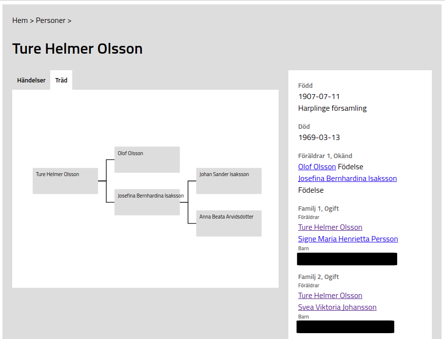

# Geno

This is a web backend and frontend that can connect to a [GRAMPs](https://gramps-project.org/) sqlite database. The backend is written in python and serves a GraphQL representation of the database. The frontend is written in Typescript with React and Apollo.

To run the application first place your GRAMPs database as `sqlite.db` in the root. Resources, such as images, can be placed in `client/res/`.


## Running

### Server

```bash
cd server
poetry update
poetry run python wsgi.py
```
### Client

```bash
cd client
yarn
yarn watch
```

## Screenshots


